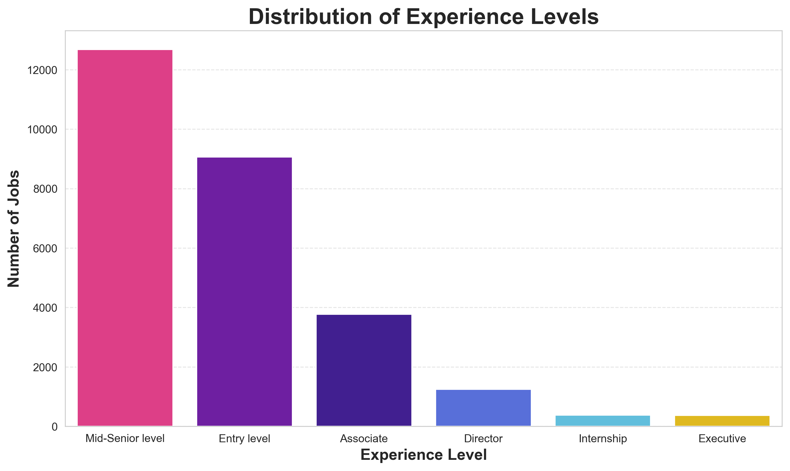
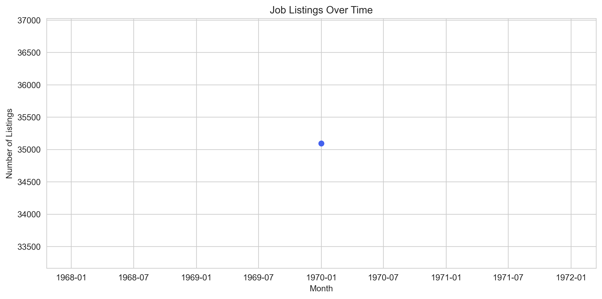
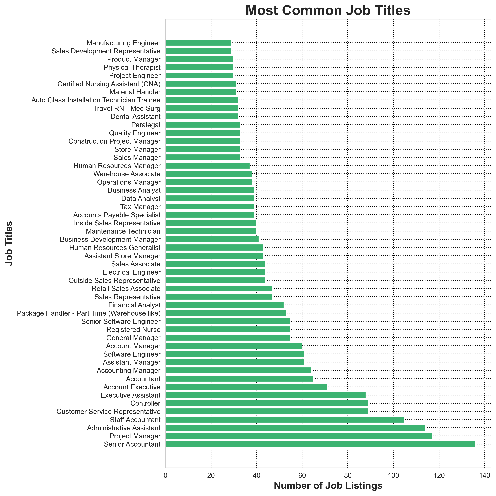
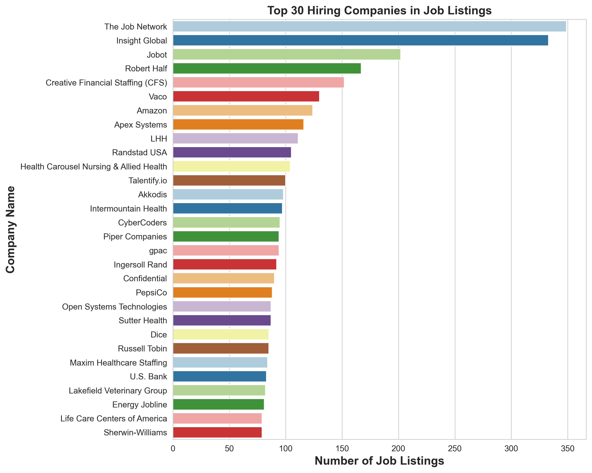
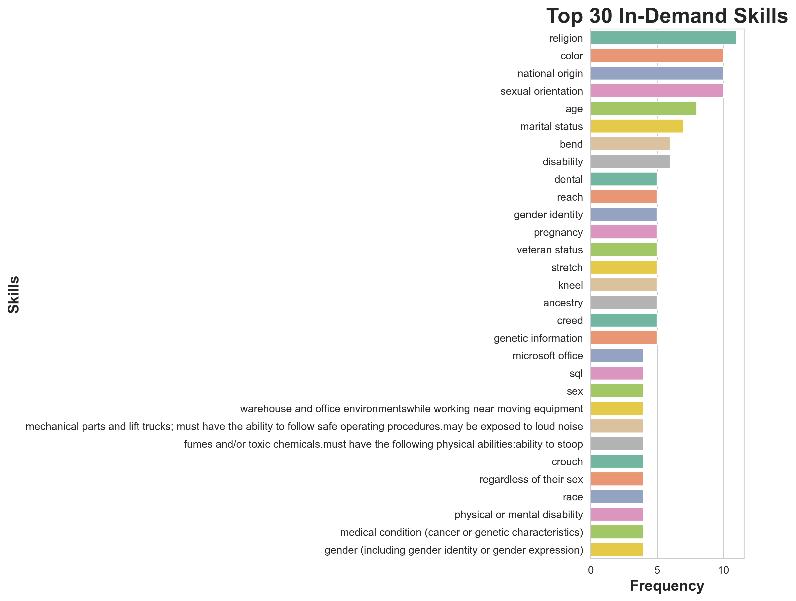

# Job-Market-Analyzer
Data Science Project (Basic): Analyze job market trends using Python, Matplotlib, Seaborn, Plotly, NumPy, Pandas

This project analyzes job listings to uncover trends in hiring, top skills, and salaries using Python and Plotly.

## Files
- `Job_Market_Analyzer.ipynb`: Main notebook with full analysis
- `Images`: Saved Plots Images

## Features
- Top Hiring Cities
- Most Common Job Titles
- Salary Distribution
- Top In-Demand Skills
- Top Hiring Companies
- Remote vs Onsite Job Distribution
- Experience Level Distribution
- Job Listings Over Time

## Tech Stack
-Python
-Pandas
-Matplotlib
-Seaborn
-Plotly

## Plots
### Experience Level Distribution

### Job Listings Over Time

### Most Common Job Titles

### Top Hiring Companies

### Top In-Demand Skills

## Conclusion
This project gives a quick overview of what's trending in the tech job market. It helps job seekers focus on the right skills and companies.
